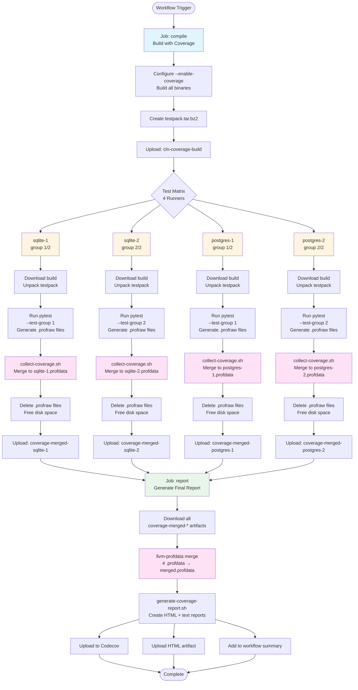

# Core Lightning Coverage Collection System

This directory contains scripts and workflows for collecting, processing, and reporting code coverage data for Core Lightning (CLN) using LLVM source-based coverage instrumentation.

## Table of Contents

- [Overview](#overview)
- [How It Works](#how-it-works)
- [GitHub Actions Workflow](#github-actions-workflow)
- [Scripts Reference](#scripts-reference)
- [Local Usage](#local-usage)
- [Troubleshooting](#troubleshooting)

## Overview

CLN uses Clang's source-based code coverage to track which lines of code are executed during tests. The system is designed to:

1. **Instrument binaries** during compilation with coverage tracking code
2. **Collect raw profile data** (`.profraw` files) as tests execute
3. **Aggregate and merge** profile data to reduce storage and transfer overhead
4. **Generate reports** showing line-by-line coverage statistics

This approach provides accurate, detailed coverage information across the entire codebase, including main binaries, plugins, and test programs.

## How It Works

### Build Phase

When building with `--enable-coverage`, CLN binaries are instrumented with LLVM coverage tracking:

```bash
./configure --enable-coverage CC=clang
make
```

This adds instrumentation that writes `.profraw` files when binaries execute.

### Collection Phase

During test execution, the `LLVM_PROFILE_FILE` environment variable controls where `.profraw` files are written:

```bash
export CLN_COVERAGE_DIR=/tmp/cln-coverage
export LLVM_PROFILE_FILE="${CLN_COVERAGE_DIR}/%p-%m.profraw"
```

- `%p` = process ID (ensures unique files per process)
- `%m` = instrumentation signature (ensures compatibility)

Each test run can generate dozens to hundreds of `.profraw` files.

### Aggregation Phase

Raw `.profraw` files are merged into compressed `.profdata` files using `llvm-profdata`:

```bash
llvm-profdata merge -sparse *.profraw -o merged.profdata
```

This dramatically reduces:
- **File count**: Thousands of files → 1 file
- **Disk usage**: ~50-80% reduction
- **Transfer time**: Significant improvement for CI/CD

### Report Generation Phase

The final `.profdata` file is used with `llvm-cov` to generate reports:

```bash
llvm-cov show <binaries> -instr-profile=merged.profdata -format=html
llvm-cov report <binaries> -instr-profile=merged.profdata
```

## GitHub Actions Workflow

The nightly coverage workflow (`.github/workflows/coverage-nightly.yaml`) implements a hierarchical merge strategy to handle disk space constraints and optimize artifact transfers.



### Workflow Phases

#### 1. Compile Job
- Builds CLN with coverage instrumentation enabled
- Creates `testpack.tar.bz2` containing all binaries and test files
- Uploads as `cln-coverage-build` artifact (~2-3 GB)

#### 2. Test Jobs (4 parallel runners)

Each runner handles a subset of tests to stay within disk space limits:

| Runner | Database | Test Group | Coverage Generated |
|--------|----------|------------|-------------------|
| sqlite-1 | SQLite | 1 of 2 | ~2-3 GB → ~500 MB |
| sqlite-2 | SQLite | 2 of 2 | ~2-3 GB → ~500 MB |
| postgres-1 | PostgreSQL | 1 of 2 | ~2-3 GB → ~500 MB |
| postgres-2 | PostgreSQL | 2 of 2 | ~2-3 GB → ~500 MB |

**Per-runner process:**
1. Download and unpack build artifact
2. Run pytest with `--test-group-count 2 --test-group N`
3. Tests generate thousands of `.profraw` files (~5 GB)
4. Install LLVM tools (llvm-profdata)
5. Run `collect-coverage.sh` to merge into single `.profdata` (~500 MB)
6. Delete `.profraw` files (frees ~4.5 GB disk space)
7. Upload `.profdata` artifact

**Key optimization:** Local aggregation before upload reduces:
- Artifact count: 4,000+ files → 4 files
- Artifact size: ~20 GB → ~2 GB
- Upload/download time: ~30 min → ~5 min
- Disk usage per runner: ~25 GB → ~15 GB

#### 3. Report Job

The final aggregation and reporting:

1. Download all 4 `.profdata` artifacts
2. Merge them into final `merged.profdata`
3. Run `generate-coverage-report.sh` to create:
   - HTML report (browsable coverage by file/function/line)
   - Text summary (overall statistics)
4. Upload to Codecov for tracking
5. Store HTML report as workflow artifact (90 days retention)

## Scripts Reference

### collect-coverage.sh

**Purpose:** Merge raw `.profraw` files into a single `.profdata` file

**Usage:**
```bash
./collect-coverage.sh [COVERAGE_DIR] [OUTPUT_FILE]

# Environment variables:
CLN_COVERAGE_DIR=/tmp/cln-coverage  # Where to find .profraw files
```

**Features:**
- Validates each `.profraw` file before merging
- Filters out corrupt, empty, or incomplete files
- Handles "argument list too long" errors via batched merging
- Uses `-sparse` flag for efficient compression
- Parallelizes validation across CPU cores

**Output:**
- `coverage/merged.profdata` (default)
- Validation statistics

**Example:**
```bash
export CLN_COVERAGE_DIR=/tmp/cln-coverage
./contrib/coverage/collect-coverage.sh
# Output: coverage/merged.profdata
```

### generate-coverage-report.sh

**Purpose:** Generate HTML and text coverage reports from merged profile data

**Usage:**
```bash
./generate-coverage-report.sh [PROFDATA_FILE] [OUTPUT_DIR]
```

**Features:**
- Auto-discovers all instrumented binaries from Makefile
- Generates interactive HTML report with line-by-line coverage
- Generates text summary with file/function statistics
- Handles main binaries, plugins, and test programs

**Output:**
- `coverage/html/index.html` - Browsable HTML report
- `coverage/summary.txt` - Text statistics

**Example:**
```bash
./contrib/coverage/generate-coverage-report.sh coverage/merged.profdata
# Browse: coverage/html/index.html
```

### per-test-coverage.sh

**Purpose:** Generate individual coverage reports for each test

**Usage:**
```bash
./per-test-coverage.sh [COVERAGE_DIR] [OUTPUT_DIR]
```

**Requirements:**
- Tests must organize `.profraw` files into subdirectories by test name
- Requires `CLN_TEST_NAME` environment variable during test execution

**Features:**
- Processes coverage data organized per test
- Creates `.profdata` and `.txt` summary for each test
- Helps identify which tests cover which code

**Output:**
- `coverage/per-test/<testname>.profdata`
- `coverage/per-test/<testname>.txt`

**Example:**
```bash
# During testing:
export CLN_COVERAGE_DIR=/tmp/cln-coverage
export CLN_TEST_NAME=test_connect  # Creates subdir per test

# After testing:
./contrib/coverage/per-test-coverage.sh
```

### per-test-coverage-html.sh

**Purpose:** Generate HTML reports for each test's coverage

**Usage:**
```bash
./per-test-coverage-html.sh [PROFDATA_DIR] [OUTPUT_DIR]
```

**Dependencies:**
- Requires `per-test-coverage.sh` to be run first

**Output:**
- `coverage/per-test-html/<testname>/index.html` for each test

**Example:**
```bash
./contrib/coverage/per-test-coverage.sh
./contrib/coverage/per-test-coverage-html.sh
# Browse: coverage/per-test-html/*/index.html
```

### clang-coverage-report.sh

**Purpose:** Simple script to generate HTML from a single `.profraw` file

**Usage:**
```bash
./clang-coverage-report.sh BINARY RAW_PROFILE_FILE TARGET_HTML_FILE
```

**Use case:** Quick coverage check for a single test or binary

**Example:**
```bash
./contrib/coverage/clang-coverage-report.sh \
    channeld/test/run-full_channel \
    full_channel.profraw \
    full_channel.html
```

### cleanup-corrupt-profraw.sh

**Purpose:** Interactive utility to find and remove corrupt `.profraw` files

**Usage:**
```bash
./cleanup-corrupt-profraw.sh [COVERAGE_DIR]
```

**Features:**
- Scans for corrupt/invalid `.profraw` files
- Uses `llvm-profdata show` to validate each file
- Asks for confirmation before deletion
- Useful when merging fails due to corrupt data

**Example:**
```bash
./contrib/coverage/cleanup-corrupt-profraw.sh /tmp/cln-coverage
# Scans, lists corrupt files, prompts to delete
```

## Local Usage

### Basic Local Coverage Collection

1. **Build with coverage:**
   ```bash
   ./configure --enable-coverage CC=clang
   make
   ```

2. **Set coverage environment:**
   ```bash
   export CLN_COVERAGE_DIR=/tmp/cln-coverage
   mkdir -p "$CLN_COVERAGE_DIR"
   export LLVM_PROFILE_FILE="${CLN_COVERAGE_DIR}/%p-%m.profraw"
   ```

3. **Run tests:**
   ```bash
   make check
   # or
   pytest tests/
   ```

4. **Collect and merge coverage:**
   ```bash
   ./contrib/coverage/collect-coverage.sh
   ```

5. **Generate report:**
   ```bash
   ./contrib/coverage/generate-coverage-report.sh
   open coverage/html/index.html
   ```

### Per-Test Coverage

To see which tests cover which code:

1. **Enable test-name tracking during pytest:**
   ```bash
   # Modify pytest fixture to set CLN_TEST_NAME per test
   export CLN_COVERAGE_DIR=/tmp/cln-coverage
   pytest tests/
   ```

2. **Generate per-test reports:**
   ```bash
   ./contrib/coverage/per-test-coverage.sh
   ./contrib/coverage/per-test-coverage-html.sh
   ```

3. **Browse results:**
   ```bash
   open coverage/per-test-html/*/index.html
   ```

## Troubleshooting

### "No .profraw files found"

**Cause:** Tests didn't generate coverage data

**Solutions:**
- Verify binaries are instrumented: `nm lightningd/lightningd | grep __llvm_profile`
- Check `LLVM_PROFILE_FILE` environment variable is set
- Ensure `CLN_COVERAGE_DIR` directory exists and is writable

### "Argument list too long" during merge

**Cause:** Too many `.profraw` files to pass on command line

**Solution:** `collect-coverage.sh` handles this automatically via batched merging

### "Profile data is malformed"

**Cause:** Corrupt or incomplete `.profraw` files (often from crashed tests)

**Solutions:**
- Run `cleanup-corrupt-profraw.sh` to identify and remove corrupt files
- `collect-coverage.sh` automatically filters these out

### High disk usage during CI

**Cause:** Raw `.profraw` files are large and accumulate quickly

**Solutions:**
- ✅ Split tests across more runners (reduce per-runner coverage generation)
- ✅ Merge locally and delete raw files (implemented in workflow)
- ✅ Use pytest-test-groups to partition tests evenly
- Free up disk space before tests: use GitHub Actions disk cleanup utilities

### Binaries not found during report generation

**Cause:** Scripts run from wrong directory, or binaries not built

**Solutions:**
- Ensure you run scripts from repository root: `cd $GITHUB_WORKSPACE`
- Verify build completed: `ls lightningd/lightningd`
- Check configure used `--enable-coverage`

## Technical Details

### File Formats

- **`.profraw`**: Raw binary profile data (uncompressed, ~1-5 MB per file)
- **`.profdata`**: Merged, indexed profile data (compressed, sparse format)

### LLVM Tools

- **`llvm-profdata`**: Merges, indexes, and validates profile data
- **`llvm-cov show`**: Generates HTML with source code and line coverage
- **`llvm-cov report`**: Generates text summary tables

### GitHub Actions Constraints

- **Disk space**: ~25-29 GB available per runner (ubuntu-22.04)
- **Artifact size**: Recommend keeping under 1 GB per artifact
- **Concurrency**: 4 parallel test runners balance speed vs. resource usage

### Coverage Overhead

- **Build time**: +10-15% (instrumentation)
- **Binary size**: +50-100% (instrumentation code)
- **Runtime**: +20-30% (profiling overhead)
- **Disk usage**: ~1-2 MB per test (raw profraw files)

## References

- [LLVM Source-Based Code Coverage](https://clang.llvm.org/docs/SourceBasedCodeCoverage.html)
- [GitHub Actions: Ubuntu Runner Specs](https://docs.github.com/en/actions/using-github-hosted-runners/about-github-hosted-runners)
- [pytest-test-groups Plugin](https://github.com/mark-adams/pytest-test-groups)
