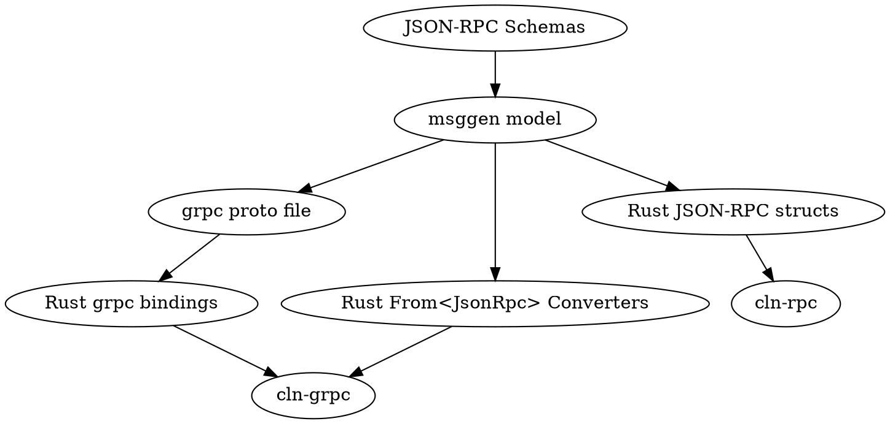

# MsgGen - Generating language bindings and docs from schemas and wire descriptions

MsgGen is a collection of tools that are used to parse schemas and
(eventually) protocol wire CSVs into an intermediate representation in
memory, and then generate language specific bindings and
documentation from it.

The dependency graph looks like this:

