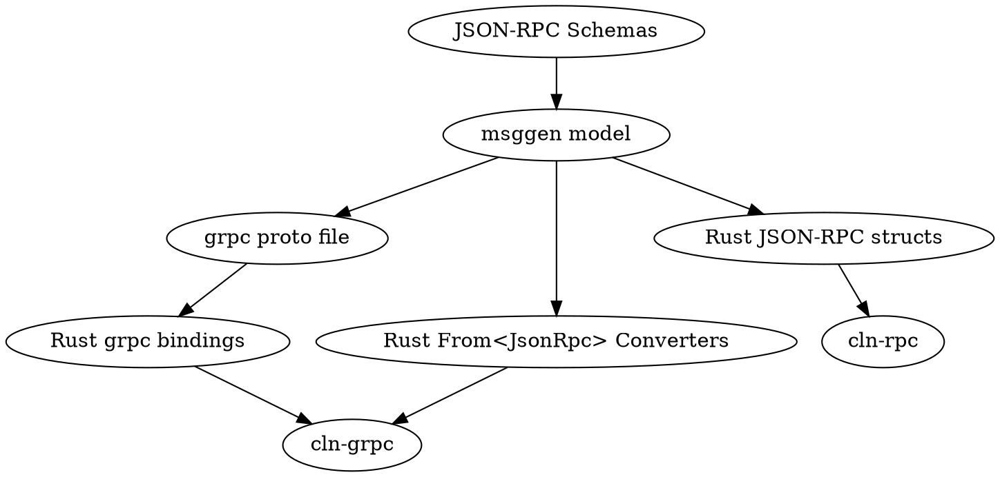

# MsgGen - Generating language bindings and docs from schemas and wire descriptions

MsgGen is a collection of tools that are used to parse schemas and
(eventually) protocol wire CSVs into an intermediate representation in
memory, and then generate language specific bindings and
documentation from it.

The dependency graph looks like this:

`msggen` will load the schemas in `doc/schemas` into memory, and then
use `Patches` to enrich the model before using it to generate the
bindings for the various languages as well as the converters from one
format to another. These patches can be found in `msggen/patch.py` and
perform a variety of operations:

 - Annotate the model with additional data from external sources, such
   as the `.msggen.json` file at the repository root to track details
   that can be derived but should remain constant (grpc field
   numbering and versioning information)
 - Aggregate common types with type overrides and omit fields that we
   can't map currently.
 - Infer optionality based on the versions a field was added or
   deprecated, and the currently supported range of versions.

If there is a field that is currently missing in the model, that is in
the schemas it is most likely because it has been marked as omitted in
the patch.
