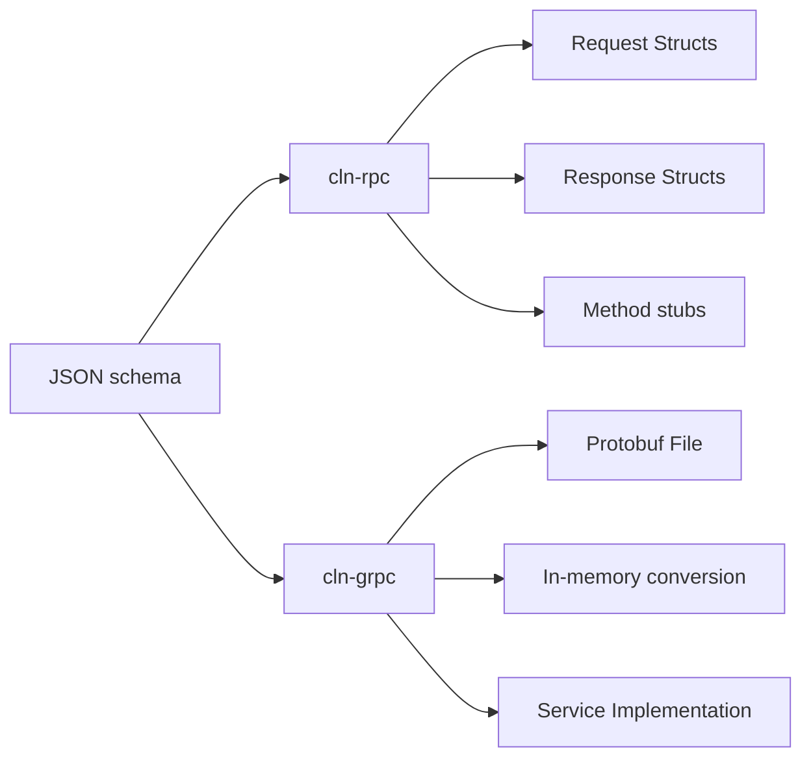
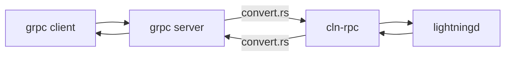

# Code Generation

The CLN project has a multitude of interfaces, most of which are
generated from an abstract schema:

 - Wire format for peer-to-peer communication: this is the binary
   format that is specific by the [LN spec][spec]. It uses the
   [generate-wire.py][generate-wire.py] script to parse the (faux) CSV
   files that are automatically extrated from the specification and
   writes C source code files that are then used internally to encode
   and decode messages, as well as provide print functions for the
   messages.

 - Wire format for inter-daemon communication: CLN follows a
   multi-daemon architecture, making communication explicit across
   daemons. For this inter-daemon communication we use a slightly
   altered message format from the [LN spec][spec]. The changes are 1)
   addition of FD passing semantics to allow establishing a new
   connection between daemons (communication uses
   [socketpair][socketpair]s, so no `connect`), and 2) change the
   message length prefix from `u16` to `u32`, allowing for messages
   larger than 65Kb. The CSV files are with the respective sub-daemon
   and also use [generate-wire.py][generate-wire.py] to generate
   encoding, decoding and printing functions.

 - We describe the JSON-RPC using [JSON Schema][jschema] in the
   [`doc/schemas`][doc-schemas] directory. Each method has a
   `.request.json` for the request message, and a `.schema.json` for
   the response (the mismatch is historical and will eventually be
   addressed). During tests the `pytest` target will verify responses,
   however the JSON-RPC methods are _not_ generated (yet?). We do
   generate various client stubs for languages, using the
   [`msggen`][msggen] tool. More on the generated stubs and utilities
   below.

## Man pages

The [manpages][man] are partially generated from the JSON schemas
using the [`fromschema`][fromschema] tool. It reads the request schema
and fills in the manpage between two markers:

```markdown
[comment]: # (GENERATE-FROM-SCHEMA-START)
...
[comment]: # (GENERATE-FROM-SCHEMA-END)
```

!!! note

	Some of this functionality overlaps with [`msggen`][msggen] (parsing the Schemas)
	and [blockreplace.py][blockreplace.py] (filling in the template). It
	is likely that this will eventually be merged.

[blockreplace.py]: https://github.com/ElementsProject/lightning/blob/master/devtools/blockreplace.py
[man]: ../../reference/
[fromschema]: https://github.com/ElementsProject/lightning/blob/master/tools/fromschema.py

## `msggen`

`msggen` is used to generate JSON-RPC client stubs, and converters
between in-memory formats and the JSON format. In addition, by
chaining some of these we can expose a [grpc][grpc] interface that
matches the JSON-RPC interface. This conversion chain is implemented
in the [grpc-plugin][grpc-plugin]


<figure markdown>

<figcaption>Artifacts generated from the JSON Schemas using `msggen`</figcaption>
</figure>

### `cln-rpc`

We use `msggen` to generate the Rust bindings crate
[`cln-rpc`][cln-rpc]. These bindings contain the stubs for the
JSON-RPC methods, as well as types for the request and response
structs. The [generator code][cln-rpc-gen] maps each abstract JSON-RPC
type to a Rust type, minimizing size (e.g., binary data is
hex-decoded).

The calling pattern follows the `call(req_obj) -> resp_obj` format,
and the individual arguments are not expanded. For more ergonomic
handling of generic requests and responses we also define the
`Request` and `Response` enumerations, so you can hand them to a
generic function without having to resort to dynamic dispatch.

The remainder of the crate implements an async/await JSON-RPC client,
that can deal with the Unix Domain Socket [transport][man:json-rpc]
used by CLN.

### `cln-grpc`

The `cln-grpc` crate is mostly used to provide the primitives to build
the `grpc-plugin`. As mentioned above, the grpc functionality relies on a chain of generated parts:

 - First `msggen` is used to generate the [protobuf file][proto],
   containing the service definition with the method stubs, and the types
   referenced by those stubs.
 - Next it generates the `convert.rs` file which is used to convert
   the structs for in-memory representation from `cln-rpc` into the
   corresponding protobuf structs.
 - Finally `msggen` generates the `server.rs` file which can be bound
   to a grpc endpoint listening for incoming grpc requests, and it
   will convert the request and forward it to the JSON-RPC. Upon
   receiving the response it gets converted back into a grpc response
   and sent back.



[proto]: https://github.com/ElementsProject/lightning/blob/master/cln-grpc/proto/node.proto
[man:json-rpc]: ../../lightningd-rpc.7.md
[cln-rpc-gen]: https://github.com/ElementsProject/lightning/blob/master/contrib/msggen/msggen/gen/rust.py
[spec]: https://github.com/lightning/bolts
[generate-wire.py]: https://github.com/ElementsProject/lightning/blob/master/tools/generate-wire.py
[socketpair]: https://man7.org/linux/man-pages/man2/socketpair.2.html
[jschema]: https://json-schema.org/
[doc-schemas]: https://github.com/ElementsProject/lightning/tree/master/doc/schemas
[msggen]: https://github.com/ElementsProject/lightning/tree/master/contrib/msggen
[grpc]: https://grpc.io/
[cln-grpc]: https://docs.rs/cln-grpc/0.1.1/cln_grpc/
[grpc-plugin]: https://github.com/ElementsProject/lightning/tree/master/plugins/grpc-plugin
[cln-rpc]: https://github.com/ElementsProject/lightning/tree/master/cln-rpc
