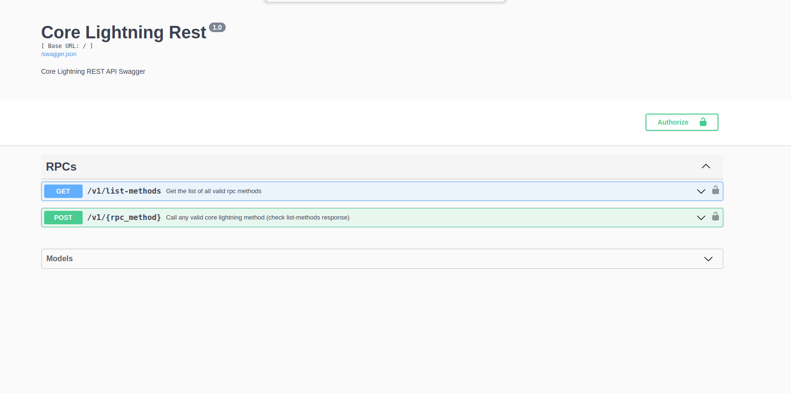
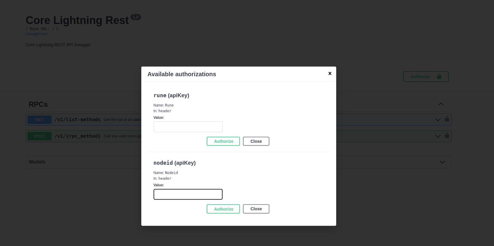
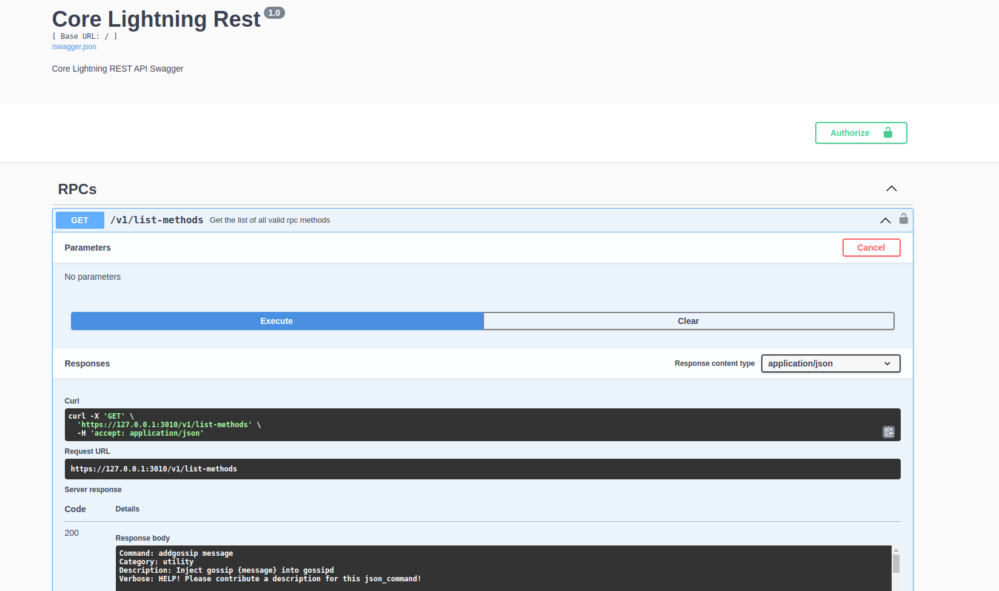
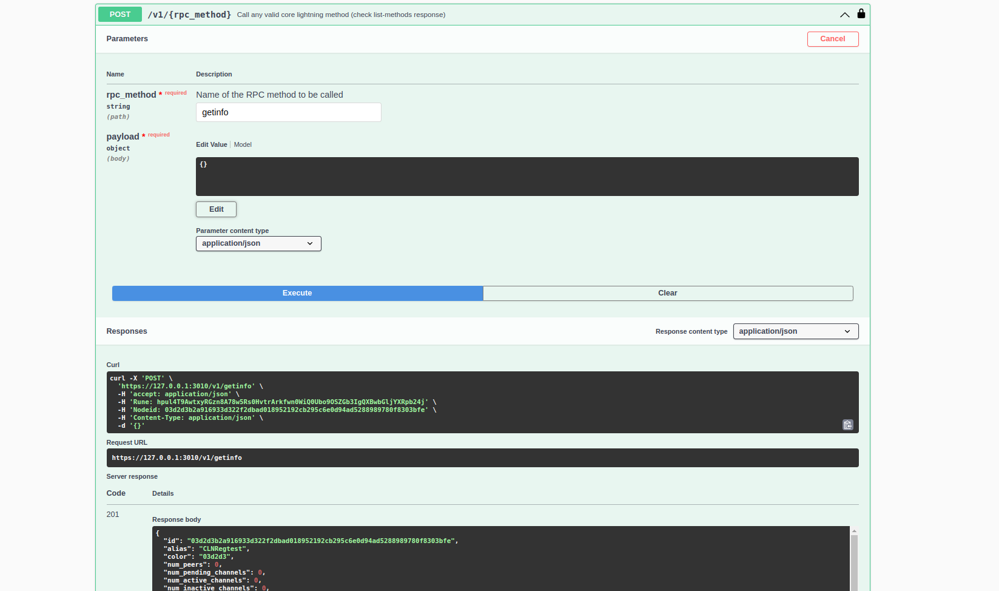
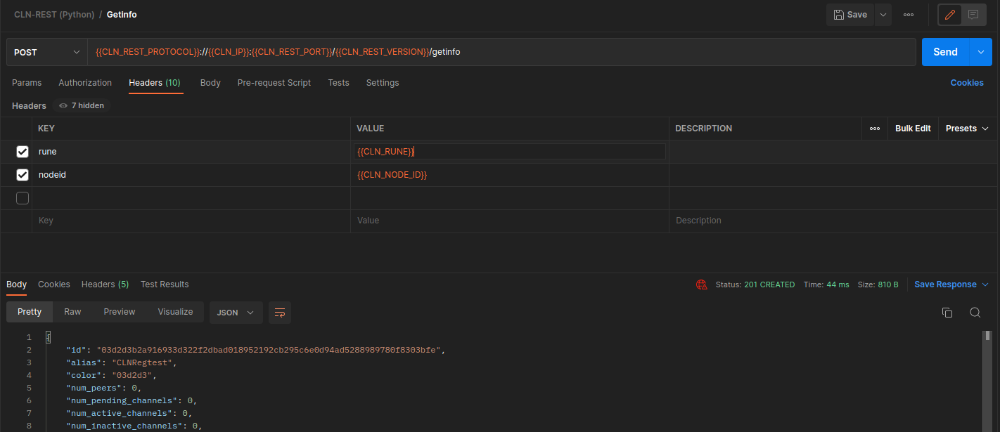
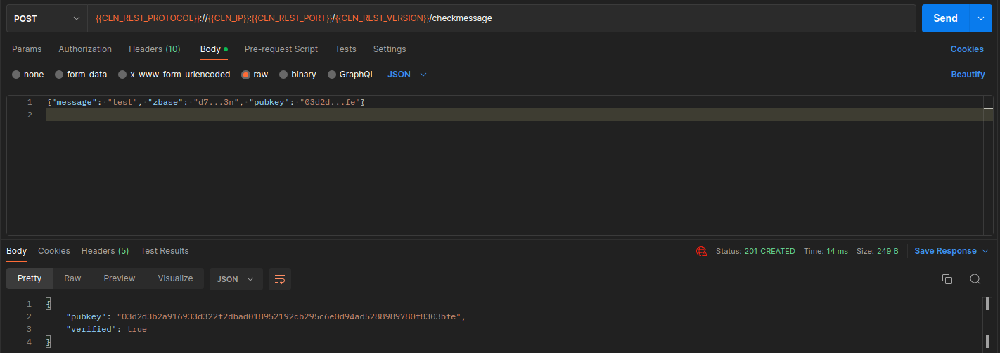
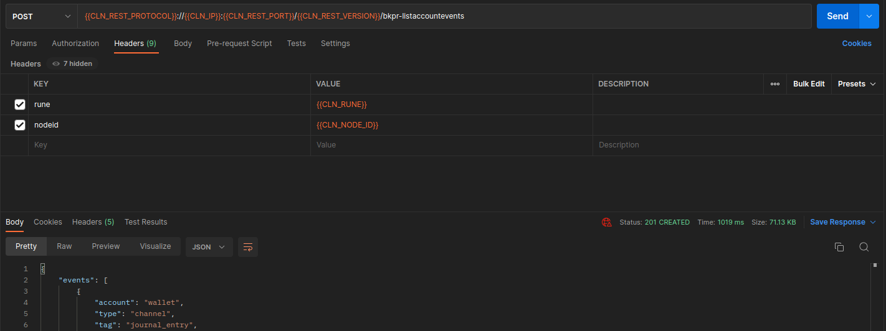

# CLNRest

CLNRest is a lightweight Python-based core lightning plugin that transforms RPC calls into a REST service. By generating REST API endpoints, it enables the execution of Core Lightning's RPC methods behind the scenes and provides responses in JSON format.

## Installation

Install required packages with `pip install json5 flask flask_restx gunicorn pyln-client` or `pip install -r requirements.txt`.

Note: if you have the older c-lightning-rest plugin, you can use `disable-plugin clnrest.py` to avoid any conflict with this one.  Of course, you could use this one instead!

## Configuration

If `rest-port` is not specified, the plugin will disable itself.

- --rest-port: Sets the REST server port to listen to (3010 is common)
- --rest-protocol: Specifies the REST server protocol. Default is HTTPS.
- --rest-host: Defines the REST server host. Default is 127.0.0.1.
- --rest-certs: Defines the path for HTTPS cert & key. Default path is same as RPC file path to utilize gRPC's client certificate. If it is missing at the configured location, new identity (`client.pem` and `client-key.pem`) will be generated.

## Plugin

- It can be configured by adding `plugin=/<path>/clnrest/clnrest.py` to the Core Lightning's config file.

## Server

With the default configurations, the Swagger user interface will be available at https://127.0.0.1:3010/. The POST method requires `rune` and `nodeid` headers for authorization.

### cURL
Example curl command for POST will also require `rune` and `nodeid` headers like below:
    `curl -k -X POST 'https://127.0.0.1:3010/v1/getinfo' -H 'Rune: <node-rune>' -H 'Nodeid: <node-id>'`

With `-k` or `--insecure` option curl proceeds with the connection even if the SSL certificate cannot be verified.
This option should be used only when testing with self signed certificate.

### Swagger

    
    
    
    

### Postman

    
    
    

